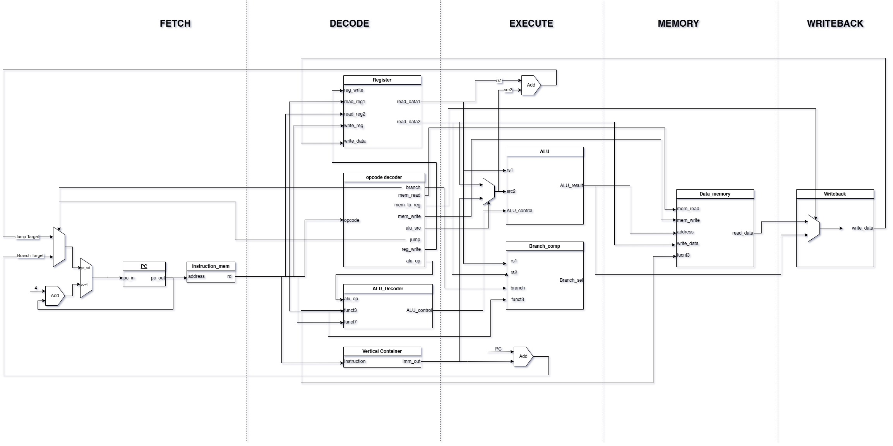

# RISCV-RV32I 5 Stage Pipelined Processor

## Overview
This project is a design and implementation of a RISCV-RV32I 5 stage pipelined processor. It explores the intricacies of pipelined architecture by breaking down the processor into five distinct stages:
- **Instruction Fetch (IF)**
- **Instruction Decode (ID)**
- **Execute (EX)**
- **Memory Access (MEM)**
- **Write Back (WB)**

## Features
- **5 Stage Pipeline Architecture:** Efficient processing by dividing the instruction cycle.
- **RISCV-RV32I Compliance:** Fully supports the basic RISCV instruction set.
- **Hazard Detection and Forwarding:** Implements strategies to minimize stalls and maintain performance.
- **Modular Design:** Facilitates testing and future enhancements.
- **Simulation Testbenches:** Ready-to-use simulation environments for verifying design correctness.

## Architecture
Below is a high-level view of the processor architecture.

## Testing

The design has been rigorously tested using multiple instruction sets covering arithmetic, logical operations, memory access, and control flow. Detailed test cases can be found in the [TESTS.md](tests.md) file.

## Getting Started

### Prerequisites
- **Simulation Tools:** e.g., ModelSim, Vivado, or any compatible simulation environment.
- **Basic Knowledge:** Understanding of the RISCV architecture and pipelined processor design.

## References
1. **Computer Architecture, Sixth Edition: A Quantitative Approach** – Book by John L. Hennessy and David A. Patterson, covering modern processor architectures, including pipelining concepts applied in this project.
2. **RISCV_CARD.pdf** – Summary of the RISC-V instruction set architecture.
3. **Design and Implementation of 32-bit RISC-V Processor Using Verilog** – Research paper detailing the methodology for implementing a RISC-V processor in Verilog.
