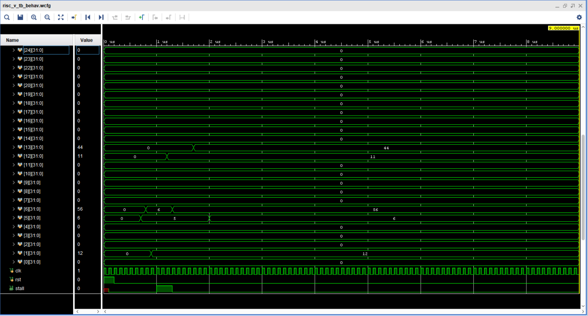

# Test Cases Documentation

This document outlines the test cases used to verify the functionality of the RISCV-RV32I 5-Stage Pipelined Processor. Each test case targets different aspects of the processor, including arithmetic operations, logical operations, memory access, branching, and control flow.

The corresponding hex code files are included in the `code` directory:
- `code/test1.mem`
- `code/test2.mem`
- `code/test3.mem`

---

## Test Set 1: Basic Arithmetic and Memory Operations

**Objective:**
- Verify arithmetic operations (addition, subtraction, bitwise operations).
- Test memory load/store operations.
- Check branching behavior.

**Assembly Instructions:**
```assembly
addi x5, x0, 9       # x5 = 9
addi x6, x0, 8       # x6 = 8
add  x7, x5, x6      # x7 = x5 + x6 = 17
sub  x8, x5, x6      # x8 = x5 - x6 = 1
and  x9, x5, x6      # x9 = x5 & x6 = 8
slli x10, x7, 5      # x10 = x7 << 5 = 544
srli x11, x7, 5      # x11 = x7 >> 5 = 0
sw   x7, 0(x6)       # Store x7 (17) to memory at address in x6 (8)
lw   x12, 0(x6)      # Load from memory at address in x6 (8) to x12
addi x12, x12, 1     # x12 += 1
lui  x13, 48         # x13 = 48 << 12
add  x12, x12, x13   # x12 += x13
sw   x12, 0(x6)      # Store x12 to memory at x6
lw   x13, 0(x6)      # Load x13 from memory
auipc x17, 191       # x17 = PC + (191 << 12)
```

**Waveform Result:**


---

## Test Set 2: Logical Operations and Conditional Branching

**Objective:**
- Verify logical operations and shift operations.
- Ensure correct behavior of branch conditions.

**Assembly Instructions:**
```assembly
addi x5, x0, 5       # x5 = 5
addi x6, x0, 6       # x6 = 6
add  x7, x5, x6      # x7 = x5 + x6 = 11
sub  x8, x5, x6      # x8 = x5 - x6 = -1
or   x9, x5, x6      # x9 = x5 | x6
xor  x10, x5, x6     # x10 = x5 ^ x6
slti x11, x11, 5     # x11 = (x11 < 5) ? 1 : 0
sw   x11, 0(x0)      # Store x11 to memory
lw   x12, 0(x0)      # Load x12 from memory
blt  x12, x8, 12     # Branch if x12 < x8 (shouldn't branch)
blt  x12, x5, 28     # Branch if x12 < x5 (should branch)
addi x13, x0, 3      # x13 = 3
addi x14, x13, 0     # x14 = x13 = 3
sw   x14, 0(x13)     # Store x14 to memory at x13
lw   x15, 0(x13)     # Load x15 from memory at x13
blt  x13, x15, 16    # Branch if x13 < x15 (shouldn't branch)
jal  x0, 0           # Jump to current instruction (infinite loop)
```

**Waveform Result:**


---

## Test Set 3: Jump and Link Operations

**Objective:**
- Validate jump and link instructions.
- Ensure correct execution of function calls and return mechanisms.

**Assembly Instructions:**
```assembly
addi x5, x0, 5       # x5 = 5
addi x6, x0, 6       # x6 = 6
jal  x1, 24          # Jump to instruction at PC + 24, store return address in x1
addi x7, x0, 7       # (shouldn't execute) x7 = 7
addi x8, x0, 8       # (shouldn't execute) x8 = 8
addi x9, x0, 9       # (shouldn't execute) x9 = 9
addi x10, x0, 10     # (shouldn't execute) x10 = 10
addi x11, x0, 11     # (shouldn't execute) x11 = 11
add  x12, x5, x6     # x12 = x5 + x6 = 11
addi x6, x6, 50      # x6 += 50
jalr x13, x6, 0      # Jump to address in x6, store return address in x13
addi x13, x0, 15     # (shouldn't execute) x13 = 15
addi x14, x0, 16     # (shouldn't execute) x14 = 16
addi x15, x0, 17     # (shouldn't execute) x15 = 17
addi x5, x5, 1       # x5 += 1
```

**Waveform Result:**


---

## How to Run the Tests
1. Ensure that the processor simulation environment is correctly set up.
2. The `Instruction_memory.v` module in the `code` directory is configured to load a `.mem` file into memory:
   ```verilog
   
   initial begin
       $readmemh("test1.mem", mem); // Load instructions from hex file
   end
   ```
3. To run a specific test, modify `Instruction_memory.v` to load the corresponding test file:
   - `test1.mem` for basic arithmetic and memory operations.
   - `test2.mem` for logical operations and branching.
   - `test3.mem` for jump and link instructions.
4. Run the simulation in Vivado, and verify the expected results based on the assembly instructions.

---

## Conclusion

These test cases systematically verify the execution of fundamental instructions in the RV32I (RISC-V 32-bit Integer) instruction set, ensuring the correct implementation of arithmetic, logical, memory access, and control flow operations. The RV32I architecture forms the foundation of many RISC-V processors, and validating its instruction set is crucial for building reliable and efficient CPU designs. By running these test cases, we confirm the functional correctness of the 5-stage pipelined processor, ensuring that it adheres to the expected behavior defined by the RISC-V ISA. Any deviations in the waveform results should be carefully analyzed to debug potential pipeline hazards, forwarding issues, or incorrect instruction decoding.

This testing methodology can be extended to validate additional instructions and custom extensions if required. Further optimizations, such as branch prediction, can be incorporated to enhance processor performance.


